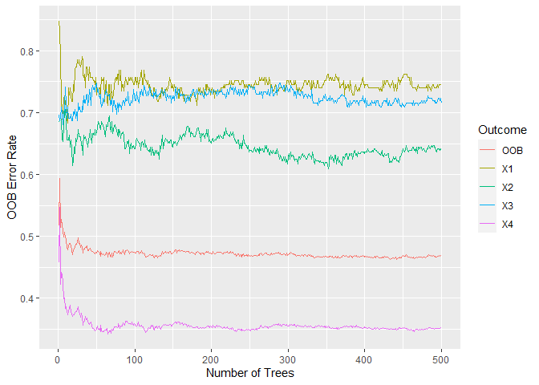

Puerto Rico Poverty Project
================
Treva Tam, Sneha Mani, and Nana Adjeiwaa-Manu
5 May 2020

This project aims to predict poverty for Costa Rican households using
household level data. Using information about a family’s observable
household attributes like the material of their walls and floor, or if
the household has access to drinking water, we attempt to classify their
poverty level and predict their level of need. In countries where a
large proportion of the population are not part of the formal labor
market and are dependent on multiple sources for their income and
sustenance, targeting of social programs becomes challenging. In Latin
America, the Proxy Means Test is a method used to verify income
qualification to target social sector schemes. We use an alternate
machine learning approach to verify the income qualification and improve
the quality of targeting based on household level factors.

The project is divided into three parts:

1.  Data cleaning  
2.  Analyzing the data using a standard regression framework  
3.  Analyzing the data using a machine learning approach

Data Cleaning
=============

The Inter-American Development Bank provides data at a household level.
Using this data, the goal is to classify household into four poverty
categories in the variable `Target` (1 = extreme poverty, 2 = moderate
poverty, 3 = vulnerable households and 4 = non vulnerable households).
Since our research question is at the household level, we collapse the
original 9,557 observation dataset, which included several members in
one household, to only the head of household. This leaves us with a
final dataset of 2,970 unique households.

The variables we choose to focus on are household level attributes like
asset ownership, materials used in the walls/floors/ceilings, sanitary
and drinking water facilities, and education levels. We combine the
variables for years of education for the female head of house and male
head of house variables into one variable - years of education for the
head of house. The origial dataset has very little missing data except
for the variable, number of tablets the household owns. This variable is
excluded. After eliminating duplicate variables and focusing on the
household level variables, the dataset consists of 60 variables
describing the characteristics of the household and an outcome variable
classifying the level of poverty.

Preparing Data for Statistical Algorithm
----------------------------------------

Prior to carrying out our statistical algorithm, we split the data
randomly into training and test data. 80% of the observations were used
for the training dataset, while the remaining 20% were used for the test
dataset.

We then tested the correlation between pairs of the 60 predictor
variables in our dataset in order to determine whether any of them were
highly correlated. All variable pairs that had a correlation higher than
0.75 were dropped from the dataset. Afterwards, 49 variables remained in
the dataset used for analysis. The variable names of the 49 indicators
used in the analysis are shown below.

    ##  [1] "toilet"       "fridge"       "wallbrick"    "wallsocket"   "wallcement"  
    ##  [6] "wallwaster"   "wallwood"     "wallzinc"     "wallnatural"  "wallother"   
    ## [11] "floorcement"  "floorother"   "floornatural" "floorno"      "floorwood"   
    ## [16] "roofcement"   "roofnatural"  "roofother"    "ceiling"      "wateroutdoor"
    ## [21] "waterno"      "elecpvt"      "elecno"       "eleccoop"     "toiletno"    
    ## [26] "toiletseptic" "toilethole"   "toiletother"  "energyno"     "energygas"   
    ## [31] "energywood"   "children"     "adults"       "morethan65"   "bedrooms"    
    ## [36] "houseown"     "houseloan"    "houserented"  "computer"     "tv"          
    ## [41] "mobile"       "qmobilephone" "rcentral"     "rchorotega"   "rpaca"       
    ## [46] "rbrunca"      "rhetarat"     "rhuetarnorte" "eduhoh"

Regression Framework: Multinomial Logistic Regression
=====================================================

Our response variable, `Target`, is a four-category variable that
represents poverty levels. Given the composition of the response
variable, we selected multinomial logistic regression for our
statistical algorithm. Multinomial logistic regression does not assume
that there is an order to the categories in the response variable. As a
result, it is suitable for this study’s response variable, whose
categories do not have a specific order or rank.

We first ran a multinomial logistic regression that regressed our
response variable Target onto the 49 predictor variables in the training
dataset.

We then used stepwise regression (both forward and backward selection)
on this model in order to select the predictor variables that were most
relevant to our analysis. The best multinomial logistic regression using
stepwise regression had an AIC of 4149.02. However, since this model
includes 45 variables, we do not interpret this model given that there
were still too many predictor variables.

    #Multinomial Logistic Regression with all predictor variables 
    set.seed(2345)
    reg1 <- multinom(Target ~ ., data = train.data)

    #Select Best Model using Stepwise Regression
    reg2 <- stepAIC(reg1)

    ## Warning in stepAIC(reg1): 0 df terms are changing AIC

    ## Warning in stepAIC(reg1): 0 df terms are changing AIC

    ## Warning in stepAIC(reg1): 0 df terms are changing AIC

    #Best multinomial logit regression using stepwise regression (AIC=4149.02)
    reg3 <- multinom(Target ~ toilet + fridge + wallbrick + wallsocket + wallcement + 
        wallwaster + wallwood + wallzinc + wallnatural + wallother + 
        floorcement + floorother + floornatural + floorno + floorwood + 
        roofcement + roofnatural + roofother + ceiling + wateroutdoor + 
        waterno + elecpvt + elecno + eleccoop + toiletno + toiletseptic + 
        toilethole + toiletother + energyno + energygas + energywood + 
        children + adults + morethan65 + houseown + houseloan + houserented + 
        computer + qmobilephone + rcentral + rchorotega + rpaca + 
        rbrunca + rhetarat + eduhoh, data= train.data)

Variable Selection with LASSO
-----------------------------

We ran an elastic net regression with an alpha of 1, which is identical
to running a LASSO regression. The LASSO method is preferred when a
model has many independent variables, but few actually contribute to its
performance.

We keep 8 variables, seen below, after running a LASSO regression. We
found that wallbrick (if the predominant material on the outside wall of
the home is block or brick), floorcement (if the predominant material on
the floor of the home is cement), ceiling (if the home has a ceiling),
energywood (if the main source of energy used for cooking was wood or
charcoal), children (number of children ages 0 to 19 in the household),
qmobilephone (number of mobile phones), rpaca (whether the home is
located in the Pacific Central region of Costa Rica, the country’s
poorest region), and (eduhoh (education level for the head of household)
were relevant variables to our analysis. We have also included a plot
that shows the fit of the elastic net regression model.

<table>
<thead>
<tr>
<th style="text-align:left;">
x
</th>
</tr>
</thead>
<tbody>
<tr>
<td style="text-align:left;">
wallbrick
</td>
</tr>
<tr>
<td style="text-align:left;">
floorcement
</td>
</tr>
<tr>
<td style="text-align:left;">
ceiling
</td>
</tr>
<tr>
<td style="text-align:left;">
energywood
</td>
</tr>
<tr>
<td style="text-align:left;">
children
</td>
</tr>
<tr>
<td style="text-align:left;">
qmobilephone
</td>
</tr>
<tr>
<td style="text-align:left;">
rpaca
</td>
</tr>
<tr>
<td style="text-align:left;">
eduhoh
</td>
</tr>
</tbody>
</table>

Results of the Multinomial Logistic Regression
----------------------------------------------

We run our final multinomial logistic regression on these 8 relevant
variables. We report findings for statistically significant coefficients
in each of the 4 categories in our response variable `Target`. Each
category of the response variable was compared to the reference
category, extreme poverty.

### Predicted Log Odds of Moderate versus Extreme Poverty

<table class="table" style="margin-left: auto; margin-right: auto;">
<caption>
Coefficients for Moderate vs. Extreme Poverty
</caption>
<thead>
<tr>
<th style="text-align:left;">
</th>
<th style="text-align:right;">
Coefficient
</th>
<th style="text-align:right;">
Std. Errors
</th>
<th style="text-align:right;">
T Statistic
</th>
<th style="text-align:right;">
P-value
</th>
</tr>
</thead>
<tbody>
<tr>
<td style="text-align:left;">
(Intercept)
</td>
<td style="text-align:right;">
0.5300738
</td>
<td style="text-align:right;">
0.2752359
</td>
<td style="text-align:right;">
1.9258892
</td>
<td style="text-align:right;">
0.054
</td>
</tr>
<tr>
<td style="text-align:left;">
wallbrick
</td>
<td style="text-align:right;">
-0.0388145
</td>
<td style="text-align:right;">
0.2048136
</td>
<td style="text-align:right;">
-0.1895113
</td>
<td style="text-align:right;">
0.850
</td>
</tr>
<tr>
<td style="text-align:left;">
floorcement
</td>
<td style="text-align:right;">
-0.1240086
</td>
<td style="text-align:right;">
0.2130016
</td>
<td style="text-align:right;">
-0.5821957
</td>
<td style="text-align:right;">
0.560
</td>
</tr>
<tr>
<td style="text-align:left;">
ceiling
</td>
<td style="text-align:right;">
0.0678654
</td>
<td style="text-align:right;">
0.2208196
</td>
<td style="text-align:right;">
0.3073342
</td>
<td style="text-align:right;">
0.759
</td>
</tr>
<tr>
<td style="text-align:left;">
energywood
</td>
<td style="text-align:right;">
-0.2082583
</td>
<td style="text-align:right;">
0.2959858
</td>
<td style="text-align:right;">
-0.7036092
</td>
<td style="text-align:right;">
0.482
</td>
</tr>
<tr>
<td style="text-align:left;">
children
</td>
<td style="text-align:right;">
-0.1258064
</td>
<td style="text-align:right;">
0.0686644
</td>
<td style="text-align:right;">
-1.8321918
</td>
<td style="text-align:right;">
0.067
</td>
</tr>
<tr>
<td style="text-align:left;">
qmobilephone
</td>
<td style="text-align:right;">
0.2832102
</td>
<td style="text-align:right;">
0.0855580
</td>
<td style="text-align:right;">
3.3101548
</td>
<td style="text-align:right;">
0.001
</td>
</tr>
<tr>
<td style="text-align:left;">
rpaca
</td>
<td style="text-align:right;">
-0.0354133
</td>
<td style="text-align:right;">
0.3011627
</td>
<td style="text-align:right;">
-0.1175886
</td>
<td style="text-align:right;">
0.906
</td>
</tr>
<tr>
<td style="text-align:left;">
eduhoh
</td>
<td style="text-align:right;">
-0.0217361
</td>
<td style="text-align:right;">
0.0265778
</td>
<td style="text-align:right;">
-0.8178279
</td>
<td style="text-align:right;">
0.413
</td>
</tr>
</tbody>
</table>

**Significant Predictors.** The number of children ages 0 to 19 in the
household and the number of mobile phones in the household were
statistically significant predictors of the odds of being in moderate as
opposed to extreme poverty.

**Analysis.** The log odds of being in moderate poverty versus extreme
poverty will decrease by 0.125 as the number of children from ages 0 to
19 in the household increases. In other words, the more children are in
the household, the lower the odds the household will be in moderate as
opposed to extreme poverty.

Further, the log odds of being in moderate poverty versus extreme
poverty will increase by 0.238 as the number of moble phones in the
household increases. The more mobile phones a household has, the higher
the odds it will be in moderate as opposed to extreme poverty.

### Predicted Log Odds of Vulnerable Households versus Extreme Poverty

<table class="table" style="margin-left: auto; margin-right: auto;">
<caption>
Coefficients for Vulnerable HH vs. Extreme Poverty
</caption>
<thead>
<tr>
<th style="text-align:left;">
</th>
<th style="text-align:right;">
Coefficient
</th>
<th style="text-align:right;">
Std. Errors
</th>
<th style="text-align:right;">
T Statistic
</th>
<th style="text-align:right;">
P-value
</th>
</tr>
</thead>
<tbody>
<tr>
<td style="text-align:left;">
(Intercept)
</td>
<td style="text-align:right;">
0.0383812
</td>
<td style="text-align:right;">
0.2953813
</td>
<td style="text-align:right;">
0.1299379
</td>
<td style="text-align:right;">
0.897
</td>
</tr>
<tr>
<td style="text-align:left;">
wallbrick
</td>
<td style="text-align:right;">
0.2738265
</td>
<td style="text-align:right;">
0.2146302
</td>
<td style="text-align:right;">
1.2758062
</td>
<td style="text-align:right;">
0.202
</td>
</tr>
<tr>
<td style="text-align:left;">
floorcement
</td>
<td style="text-align:right;">
-0.1816158
</td>
<td style="text-align:right;">
0.2318450
</td>
<td style="text-align:right;">
-0.7833498
</td>
<td style="text-align:right;">
0.433
</td>
</tr>
<tr>
<td style="text-align:left;">
ceiling
</td>
<td style="text-align:right;">
0.2284066
</td>
<td style="text-align:right;">
0.2347069
</td>
<td style="text-align:right;">
0.9731570
</td>
<td style="text-align:right;">
0.330
</td>
</tr>
<tr>
<td style="text-align:left;">
energywood
</td>
<td style="text-align:right;">
-0.3797947
</td>
<td style="text-align:right;">
0.3361459
</td>
<td style="text-align:right;">
-1.1298506
</td>
<td style="text-align:right;">
0.259
</td>
</tr>
<tr>
<td style="text-align:left;">
children
</td>
<td style="text-align:right;">
-0.3647100
</td>
<td style="text-align:right;">
0.0813483
</td>
<td style="text-align:right;">
-4.4833127
</td>
<td style="text-align:right;">
0.000
</td>
</tr>
<tr>
<td style="text-align:left;">
qmobilephone
</td>
<td style="text-align:right;">
0.4540984
</td>
<td style="text-align:right;">
0.0900093
</td>
<td style="text-align:right;">
5.0450155
</td>
<td style="text-align:right;">
0.000
</td>
</tr>
<tr>
<td style="text-align:left;">
rpaca
</td>
<td style="text-align:right;">
-0.1705823
</td>
<td style="text-align:right;">
0.3299667
</td>
<td style="text-align:right;">
-0.5169684
</td>
<td style="text-align:right;">
0.605
</td>
</tr>
<tr>
<td style="text-align:left;">
eduhoh
</td>
<td style="text-align:right;">
-0.0262495
</td>
<td style="text-align:right;">
0.0280404
</td>
<td style="text-align:right;">
-0.9361320
</td>
<td style="text-align:right;">
0.349
</td>
</tr>
</tbody>
</table>

**Significant Predictors.** The number of children ages 0 to 19 in the
household and the number of mobile phones in the household were
statistically significant predictors of the odds of being vulnerable to
poverty as opposed to being in extreme poverty.

**Analysis.** The log odds of being a household vulnerable to poverty
versus being in extreme poverty will decrease by 0.365 as the number of
children from ages 0 to 19 in the household increases. In other words,
the more children are in the household, the lower the odds the household
will be vulnerable to poverty as opposed to being in extreme poverty.

Finally, the log odds of being vulnerable to poverty versus being in
extreme poverty will increase by 0.454 as the number of moble phones in
the household increases. The more mobile phones a household has, the
higher the odds it will be vulnerable to poverty as opposed to being in
extreme poverty.

### Predicted Log Odds of Non-Vulnerable Households versus Extreme Poverty\*

<table class="table" style="margin-left: auto; margin-right: auto;">
<caption>
Coefficients for Non-Vulnerable HH vs. Extreme Poverty
</caption>
<thead>
<tr>
<th style="text-align:left;">
</th>
<th style="text-align:right;">
Coefficient
</th>
<th style="text-align:right;">
Std. Errors
</th>
<th style="text-align:right;">
T Statistic
</th>
<th style="text-align:right;">
P-value
</th>
</tr>
</thead>
<tbody>
<tr>
<td style="text-align:left;">
(Intercept)
</td>
<td style="text-align:right;">
-0.0413066
</td>
<td style="text-align:right;">
0.2663759
</td>
<td style="text-align:right;">
-0.1550688
</td>
<td style="text-align:right;">
0.877
</td>
</tr>
<tr>
<td style="text-align:left;">
wallbrick
</td>
<td style="text-align:right;">
0.5280443
</td>
<td style="text-align:right;">
0.1886809
</td>
<td style="text-align:right;">
2.7986102
</td>
<td style="text-align:right;">
0.005
</td>
</tr>
<tr>
<td style="text-align:left;">
floorcement
</td>
<td style="text-align:right;">
-0.2924553
</td>
<td style="text-align:right;">
0.2062445
</td>
<td style="text-align:right;">
-1.4180025
</td>
<td style="text-align:right;">
0.156
</td>
</tr>
<tr>
<td style="text-align:left;">
ceiling
</td>
<td style="text-align:right;">
0.5239478
</td>
<td style="text-align:right;">
0.2078505
</td>
<td style="text-align:right;">
2.5207910
</td>
<td style="text-align:right;">
0.012
</td>
</tr>
<tr>
<td style="text-align:left;">
energywood
</td>
<td style="text-align:right;">
-0.7503633
</td>
<td style="text-align:right;">
0.3112921
</td>
<td style="text-align:right;">
-2.4104800
</td>
<td style="text-align:right;">
0.016
</td>
</tr>
<tr>
<td style="text-align:left;">
children
</td>
<td style="text-align:right;">
-0.9184378
</td>
<td style="text-align:right;">
0.0765154
</td>
<td style="text-align:right;">
-12.0033122
</td>
<td style="text-align:right;">
0.000
</td>
</tr>
<tr>
<td style="text-align:left;">
qmobilephone
</td>
<td style="text-align:right;">
0.7219860
</td>
<td style="text-align:right;">
0.0826075
</td>
<td style="text-align:right;">
8.7399621
</td>
<td style="text-align:right;">
0.000
</td>
</tr>
<tr>
<td style="text-align:left;">
rpaca
</td>
<td style="text-align:right;">
-0.7359347
</td>
<td style="text-align:right;">
0.2996108
</td>
<td style="text-align:right;">
-2.4563021
</td>
<td style="text-align:right;">
0.014
</td>
</tr>
<tr>
<td style="text-align:left;">
eduhoh
</td>
<td style="text-align:right;">
0.1608967
</td>
<td style="text-align:right;">
0.0243630
</td>
<td style="text-align:right;">
6.6041297
</td>
<td style="text-align:right;">
0.000
</td>
</tr>
</tbody>
</table>

**Significant Predictors.** The number of children ages 0 to 19 in the
household, the number of mobile phones in the household, whether the
predominant material on the outside wall of the home was block or brick,
whether there was a ceiling in the home, whether the main source of
energy the household used for cooking was wood or charcoal, whether the
home was in Costa Rica’s Central Pacific region, and the head of
household’s years of education were statistically significant predictors
of the odds of being a non-vulnerable household as opposed to being in
extreme poverty.

**Analysis.** The log odds of not being vulnerable to poverty versus
being in extreme poverty will decrease by 0.918 as the number of
children from ages 0 to 19 in the household increases. The more children
are in the household, the lower the odds the household will be
non-vulnerable to poverty as opposed to being in extreme poverty.
Families with fewer children will likely have more resources as opposed
to those who have more children. Those with more children will have to
spread their resources more thinly and may thus be more vulnerable to
poverty as a result.

The log odds of not being vulnerable to poverty versus being in extreme
poverty will increase by 0.721 as the number of moble phones in the
household increases. The more mobile phones a household has, the higher
the odds it will be non-vulnerable to poverty as opposed to being in
extreme poverty. Families with more mobile phones may likely have more
resources and as a result be less vulnerable to extreme poverty.

The log odds of not being vulnerable to poverty versus being in extreme
poverty will increase by 0.528 if the predominant material on the
outside wall of the home is block or brick. Brick and block are more
expensive building materials than wood, for instance. Those who can
afford homes made out of these materials are likely to have more money
than those whose homes are not made out of these materials. In turn,
they would likley be less vulnerable to extreme poverty than those who
have fewer resources.

The log odds of not being vulnerable to poverty versus being in extreme
poverty will increase by 0.524 if there is a ceiling in the home. Those
who have a ceiling are more likely to have the resources that would
protect them from falling into extreme poverty.

The log odds of not being vulnerable to poverty versus being in extreme
poverty will decrease by 0.750 if the main source of energy the
household uses for cooking is wood or charcoal. Households that use less
expensive sources of energy to cook such as wood or charcoal would have
fewer resources than a household that uses gas or electricity for
cooking. Thus, they would have lower odds of not being vulnerable to
poverty as opposed to being in extreme poverty.

The log odds of not being vulnerable to poverty versus being in extreme
poverty will decrease by 0.736 if the home is in the Central Pacific
region, which is the nation’s poorest area. Homes in this area will in
turn have lower odds of not being vulnerable to poverty as opposed to
being in extreme poverty.

The log odds of not being vulnerable to poverty versus being in extreme
poverty will increase by 0.161 for each one-year increase in the head of
the household’s education. The more educated the head of the household
is, the higher the odds the household will not be vulnerable to poverty
as opposed to being in extreme poverty.

Multinomial Logistic Regression Model Prediction Accuracy
---------------------------------------------------------

We found that the multinomial logistic model correctly predicted 67.68%
of the observations in the test dataset. However, as we can see from the
confusion matrix, most of the correctly categorized households were
those that were non-vulnerable. Within the other three categories, the
majority of households were actually incorrectly misclassified as
non-vulnerable as well. We will attempt to remedy this through machine
learning methods.

<table class="table" style="margin-left: auto; margin-right: auto;">
<caption>
Confusion Matrix for MLR: Predicted Poverty Level
</caption>
<thead>
<tr>
<th style="text-align:left;">
</th>
<th style="text-align:right;">
Extreme Pov.
</th>
<th style="text-align:right;">
Moderate Pov.
</th>
<th style="text-align:right;">
Vulnerable HH
</th>
<th style="text-align:right;">
Non-Vulnerable HH
</th>
</tr>
</thead>
<tbody>
<tr>
<td style="text-align:left;">
Extreme Pov.
</td>
<td style="text-align:right;">
0
</td>
<td style="text-align:right;">
0
</td>
<td style="text-align:right;">
1
</td>
<td style="text-align:right;">
0
</td>
</tr>
<tr>
<td style="text-align:left;">
Moderate Pov.
</td>
<td style="text-align:right;">
18
</td>
<td style="text-align:right;">
24
</td>
<td style="text-align:right;">
13
</td>
<td style="text-align:right;">
15
</td>
</tr>
<tr>
<td style="text-align:left;">
Vulnerable HH
</td>
<td style="text-align:right;">
0
</td>
<td style="text-align:right;">
0
</td>
<td style="text-align:right;">
0
</td>
<td style="text-align:right;">
0
</td>
</tr>
<tr>
<td style="text-align:left;">
Non-Vulnerable HH
</td>
<td style="text-align:right;">
27
</td>
<td style="text-align:right;">
55
</td>
<td style="text-align:right;">
63
</td>
<td style="text-align:right;">
378
</td>
</tr>
</tbody>
</table>

Machine Learning: Random Forest
===============================

For the machine learning portion of the project, we decide to perform a
random forest classification algorithm. Random forest builds multiple
decision trees and merges them together to get a more accurate and
stable prediction than just a single decision tree.

Standard Random Forest
----------------------

We first tune the mtry parameter which is the number of variables
randomly sampled as candidates at each split. As seen in the plot below,
using a 10-fold cross validation and growing 500 trees in our random
forest, we find that a mtry of 7 gives us the least Out of Bag (OOB)
error.

    ## mtry = 7  OOB error = 32.95% 
    ## Searching left ...
    ## mtry = 4     OOB error = 33.54% 
    ## -0.01787995 0.05 
    ## Searching right ...
    ## mtry = 14    OOB error = 33.67% 
    ## -0.02171137 0.05

<!-- -->

    ##        mtry  OOBError
    ## 4.OOB     4 0.3354377
    ## 7.OOB     7 0.3295455
    ## 14.OOB   14 0.3367003

Using the parameters `mtry = 7` and `ntree = 500`, I fit a full random
tree classification model on 50 variables. While the overall OOB error
is 0.33, the error for 3 of the 4 classes (extreme poverty, moderate
poverty,and vulnerable households) is actually quite large. The error
for extreme poverty households is 0.93, the error for moderate poverty
is 0.77, and the error for vulnerable households is 0.97. The lower
overall OOB error is mainly due to the low OOB error of 0.05 for
non-vulnerable households. These errors are plotted below and further
confirmed in the confusion matrix of the predicted and the actual
classifiers in our training data.

We find that most households were classified as non-vulnerable. For
extreme poverty households, 66.1% were misclassifed as
non-vulnerable.For moderate poverty, 72.7% were misclassified as
non-vulnerable. And for vulnerable households, 81.7% were misclassified
as non-vulnerable. Thus, the majority of households who should have
qualified for social programs were classified as not qualifying for
these programs.

Since our goal is to help the IADB predict which households qualify for
social programs, a model that classifies non-vulnerable households
correctly, but misclassifies all vulnerable and poor households is not
useful. To adjust for this, we choose to create a model using the
balanced random forest methodology proposed by Chen, Liaw, and Brieman
(2004).

<!-- -->

<!-- -->

Balanced Random Forest
----------------------

In learning extremely imbalanced data, there is a significant
probability that a bootstrap sample contains few or even none of the
minority classes, resulting in a tree with poor performance for
predicting them. A way to address this is to down-sample which involves
sampling the majority class at frequencies closer to the rarest class.
While a down-side to down-sampling is that information in the majority
class is being thrown away, random forest models allow us to use
down-sampling without data loss since we are bootstrapping many samples
and aggregating the results.

We follow Chen, Liaw, and ’Brieman’s (2004) Balanced Random Forest (BRF)
algorithm. Instead of bootstrapping our samples from the entire dataset,
as done in the classical random forest method, we sample by strata (each
classification) and restrict their sample size to our smallest class
which is households in extreme poverty.

    predict.train.bal <- predict(rf.bal, type="response")
    mean(train.data$Target != predict.train.bal) #training error

    ## [1] 0.4684343

Using BRF gives us a training error of 0.47. This overall OOB error rate
is higher than the 0.33 error rate in the previous model. However, the
OOB Error plot shows that the errors for the vulnerable household
categories are lower than before. The error for extreme poverty is 0.74,
for moderate poverty is 0.60, and for vulnerable households is 0.73. The
error for non-vulnerable households increased to 0.35. While the overall
OOB error is higher than the standard random forest, it is much lower
for the households of interest - extremely poor, moderately poor, and
vulnerable.

    # plotting the matrix
    cm_d_p2 <-  ggplot(data = cm_d2, aes(x = Prediction , y =  Reference, fill = Perc))+
      geom_tile() +
      ggtitle("Balanced Random Forest: Predicted vs. Actual Classifiers") +
      geom_text(aes(label = paste("",Freq,",",Perc,"%")), color = 'red', size = 3.5) +
      theme_light() +
      guides(fill=FALSE) 
    plot(gg_error(rf.bal), main="Standard Random Forest: Plot of OOB Error Rate")

<!-- -->

    cm_d_p2

<!-- -->

### BRF Final Model

To avoid overfitting our model, we decided to simplify the balanced
random forest model by choosing variables with the most predictive
power.

We perform a 10 fold crossvalidation of our balanced random forest model
using the `rcfv` function. In this process, random forest models with
sequentially reduced number of predictors are generated. The predictors
are ordered by importance, and an error rate is estimated for each
model. As seen in the plot below, the “best model” balancing parsimony
and the accuracy rate is a model with 7 variables.

According to the mean accuracy rate, the 7 variables with most
prediction power (highest importance) are the years of education of the
head of household (`eduhoh`), number of children in the household
(`children`), if the house has a ceiling (`ceiling`), number of adults
in the household (`adults`), if the predominant material on the floor is
cement (`floorcement`), number of mobile phones in the household
(`qmobilephone`), and if the predominant material on the outside wall is
block or brick (`wallbrick`).

We see overlapping important variables with our logistic regression -
`wall brick`, `floorcement`, `eduhoh`, `children`, `ceiling`, and
`qmobilephone` - indicating that across models these variables are
important for prediction of the four categories.

    plot( fo$n.var,fo$error.cv, type = "h", main = "importance", 
          xlab= "number of indicators", ylab = "classifier error rate")
    axis(1, best, paste("best", best, sep="\n"), col = "red", col.axis = "red")

<!-- -->

    varImpPlot(rf.bal,  
               sort = T,
               n.var=7,
               main="Top 7 - Variable Importance")

<!-- -->

We fit a model to the 7 most “important” predictors and test the model
on our test data. Using this model, we have an overall testing error of
47% which gives us a prediction accuracy rate of 53%. While this error
rate is very large, this model accurately predicts extreme poverty
households at 33.3%, moderate poverty at 35.4% and vulnerable households
at 22.1%. From the confusion matrix shows us that of all our models,
this model predicts vulnerable, moderate, and extreme poverty households
the most accurately.

    #predict output for test
    predict.test <- predict(rf.bal.7, newdata = test.data)
    mean(test.data$Target != predict.test) #testing error

    ## [1] 0.4747475

    # plotting the matrix
    cm_d_p2 <-  ggplot(data = cm_d2, aes(x = Prediction , y =  Reference, fill = Perc))+
      geom_tile() +
      ggtitle("Final Model on Test Data: Predicted vs. Actual Classifiers") +
      geom_text(aes(label = paste("",Freq,",",Perc,"%")), color = 'red', size = 3.5) +
    theme_light() +
      guides(fill=FALSE) 
    cm_d_p2

<!-- -->

Conclusion
==========

<table class="table" style="margin-left: auto; margin-right: auto;">
<thead>
<tr>
<th style="text-align:left;">
</th>
<th style="text-align:right;">
Total
</th>
<th style="text-align:right;">
Extreme Pov
</th>
<th style="text-align:right;">
Moderate Pov
</th>
<th style="text-align:right;">
Vulnerable HH
</th>
<th style="text-align:right;">
Non-Vulnerable HH
</th>
</tr>
</thead>
<tbody>
<tr>
<td style="text-align:left;">
MLR
</td>
<td style="text-align:right;">
67.6
</td>
<td style="text-align:right;">
0.0
</td>
<td style="text-align:right;">
30.4
</td>
<td style="text-align:right;">
0.0
</td>
<td style="text-align:right;">
96.2
</td>
</tr>
<tr>
<td style="text-align:left;">
SRF
</td>
<td style="text-align:right;">
67.7
</td>
<td style="text-align:right;">
7.3
</td>
<td style="text-align:right;">
23.4
</td>
<td style="text-align:right;">
3.2
</td>
<td style="text-align:right;">
95.9
</td>
</tr>
<tr>
<td style="text-align:left;">
BRF
</td>
<td style="text-align:right;">
52.5
</td>
<td style="text-align:right;">
33.3
</td>
<td style="text-align:right;">
35.4
</td>
<td style="text-align:right;">
22.1
</td>
<td style="text-align:right;">
64.1
</td>
</tr>
</tbody>
</table>

From these models, we see that both the mulinomial logistc regression
and standard random forest have similar prediction accuracy overall.
However, when we look at the prediction accuracy within each category,
we see that this high accuracy is maily due to the accuracy of
classification for non-vulnerable households only. The largest share of
the households in our dataset are non-vulnerable households; thus,
skewing our models in favor of classifying these households accurately.
However, even when we compare the logistic regression to the standard
random forest, we see that the random forest is better able to classify
some households in the categories of extreme poverty and vulnerable.

Since the objective of is to help the IADB predict which households
qualify for social programs, a model that misclassifies all vulnerable
and poor households is not useful. To adjust for the disproportionate
number of non-vulnerable households in our dataset, we implemented a
balanced random forest which samples by each category and restricts the
sample size of each to the smallest category, which in our case was
households in extreme poverty.

Using the balanced random forest, we had an lower overall prediction
accuracy rate at 52.5%. However, within each category of interest, the
prediction rate is much higher. About a third of households in extreme
poverty or moderate poverty were accurately classified and more than 20%
of vulnerable households were classified correctly.

In addition, with our objective in mind, the misclassification of
households into the non-vulnerable category is especially harmful. For
the standard random forest, more 70% of extremely poor, moderately poor,
and vulnerable households were misclassifed as non-vulnerable. This is
especially undesirable in our model since this misclassification error
means that 70% of the households in our data that need aid from social
programs will not receive any at all since they are seen as
“non-vulnerable”.

While the balanced random forest model is still only predicting
accurately at a rate around 30% for extremely poor, moderately poor, and
vulnerable households, their misclassification as a non-vulnerable
household is much lower. Only 15% of extremely poor households are
misclassified as non-vulnerable, only 20% for moderately poor, and 27%
for vulnerable. Thus, we determine that the balanced random forest model
is the better model for identifying which households qualify for social
programs if our goal is to provide families with aid they need. Even if
extremely poor households are misclassified, they are more often
misclassified as moderately poor. Even if moderately poor households are
misclassified, they have a higher probability of being categorized as
extremely poor or vulnerable rather than as a non-vulnerable household.
While the overall prediction accuracy is lower in a balanced random
forest model, we determine that that it is the best model for the
objective of this project.
